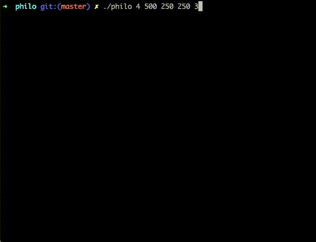
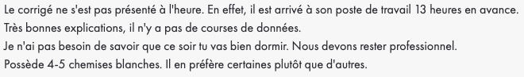

<h1 align="center">Philosopher</h1>

Neuvieme projet de [42](https://42.fr/) qui a pour but d'apprendre le comportement des threads en C.

L'objectif est d'implémenter une des solutions du [Diner des philosophes](https://fr.wikipedia.org/wiki/D%C3%AEner_des_philosophes) en utilisant les concepts suivants :

- Gestion de ressources partagées
- Gestion des problèmatiques de temps d'execution

---

### Compilation :

Pour compiler le projet, exécutez la commande suivante :

```
make
```

Pour compiler les tests unitaires, exécutez la commande suivante :

```
make test
```

### Utilisation :

Pour lancer le programme, `./philosopher` `number_of_philosophers` `time_to_die` `time_to_eat` `time_to_sleep` `[number_of_times_each_philosopher_must_eat]`

Exemple :

```
./philo 4 210 100 100 3
```

Les tests unitaires s'executent de la façon suivante :

```
./utest
```

### Démonstration :



### Intégration continue :

[](https://github.com/Florian-A/Philosopher/actions/workflows/norm.yml) [](https://github.com/Florian-A/Minishell/actions/workflows/utest+build.yml)

### Correction :

| |
| --- |
|  |

| | |
| --- | --- |
| Correcteur 1 |  |
| Correcteur 2 |  |
| Correcteur 3 |  |
